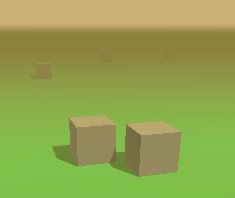
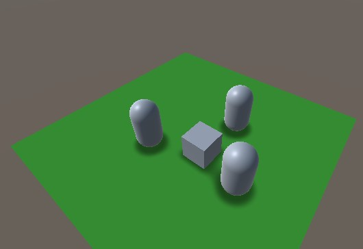
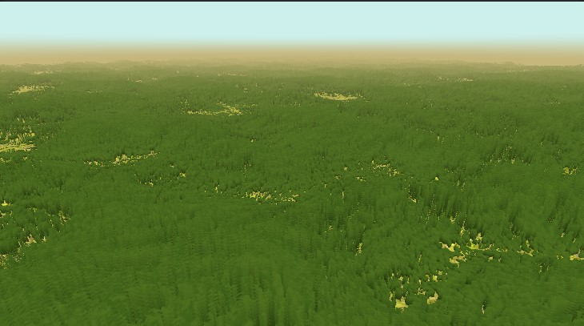
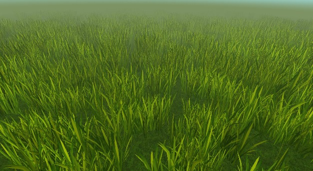
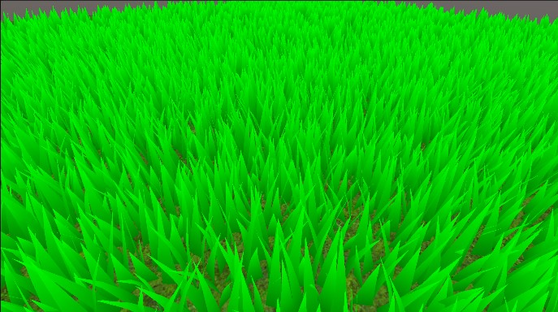
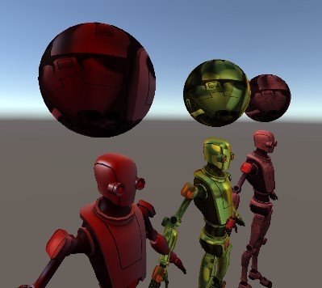
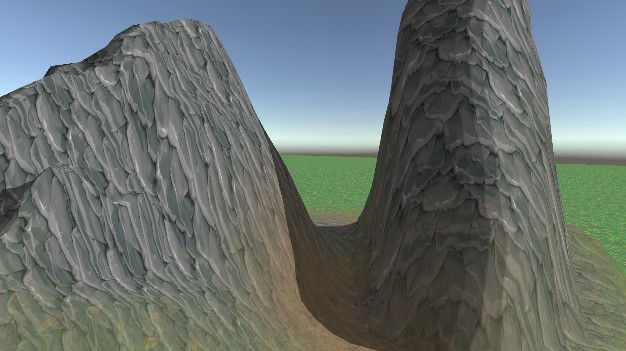

# Unity Graphics

A collection of URP shaders and render features.

> Developed and tested with Unity 2020.3.16f1 and URP 10.5.1.

## Fog Skybox

A skybox shader that blends with fog.

## Blob Shadows

A render feature that adds support for blob shadows:

- Either circle or box shape
- Can be used as primitive AO
- Includes an example shader that supports receiving blob shadows (an extension of [Toon Shader Lite](https://github.com/Delt06/urp-toon-shader#toon-shader-lite-capabilities))

### Performance
- Measured on Snapdragon 845 via Unity's GPU Profiler (OpenGL ES)
- Setup: ~20 capsules
- **Blob Shadows**: 
  - All circles 
  - Resolution per unit = 8 (further increase does not improve visual quality)
  - Shadow Distance = 15
- **Shadow Maps**:
  - Shadow Resolution = 256
  - Shadow Distance = 20
  - Soft Shadows On
  - 1 Cascade

> Note: sampling shadow maps when rendering shadow receivers is **NOT** taken into account. 

Results (in ms):
- **Blob**: 0.08 (Submit) + 0.21 (Render) = **0.29**
- **Shadow Maps**: 0.05 (Setup) + 0.21 (PrepareDrawShadows) + 0.21 (Submit) + 0.13 (Render) = **0.6**

## Drawing
Runtime drawing on the GPU side with configurable brush (color, size, hardness).

## Layered Grass

Grass shader made with the technique that is typically used for fur ([Reference](https://xbdev.net/directx3dx/specialX/Fur/index.php)).

> Warning: the shader has poor performance on both mobile and desktop platforms. It is only a technical demo, which might not be suitable for production even if further optimized.

## Billboard Grass

Billboard grass shader:
- Automatic random spread
- Per-chunk frustum culling (in the screenshot above, chunk size is 15x15)
- LOD system: the further the grass chunk from the camera, the sparser it is

## Geometry Grass

Grass implemented with geometry shader:
- Grass placement mesh is generated via Job System
- Automatic LOD system implemented in the geometry shader (controlled via material properties) 
- Based on [this tutorial](https://roystan.net/articles/grass-shader.html)

## Matcap

Basic Matcap shader. Matcap textures are taken from [this repo](https://github.com/nidorx/matcaps).

## Toon Terrain

Lightweight toon terrain shader.

- Configurable ramp (specified as a texture)
- Shadow casting and receiving
- 4 layers (splats) max